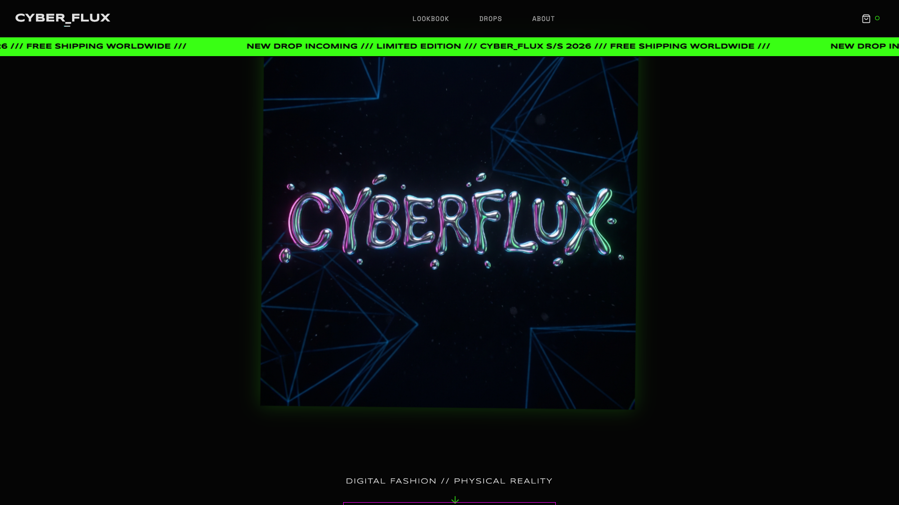
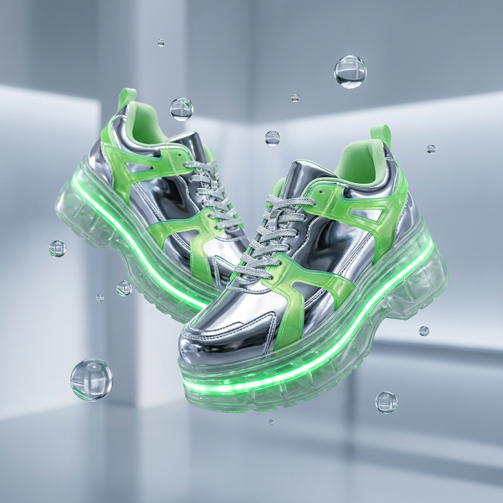

# CYBER_FLUX // GEN Z FASHION


> **DIGITAL FASHION FOR THE METAVERSE GENERATION.**
> A high-performance, visually immersive e-commerce experience channeling early 2000s digital culture.



## ⚡ Features

- **Kinetic Layout**: Sticky glitch-effect navigation and infinite scrolling marquees using CSS animations.
- **Immersive Hero**: 3D Liquid Chrome typography with parallax scroll effects.
- **Interactive Lookbook**: Horizontal drag-to-scroll product carousel with magnetic snapping.
- **Hyped Drops**: Live countdown timer with blinking urgency indicators and stock warnings.
- **Y2K Aesthetic**: Custom "Neon/Chrome" design system with scanlines, noise, and holographic gradients.

## 🛠️ Stack

- **Framework**: React + Vite
- **Styling**: Vanilla CSS (Variables + Modern Layouts)
- **Animation**: Framer Motion + CSS Keyframes
- **Icons**: Lucide React

## 🚀 Quick Start

1.  **Clone the frequency:**
    ```bash
    git clone https://github.com/your-username/cyber-flux.git
    cd cyber-flux
    ```

2.  **Install dependencies:**
    ```bash
    npm install
    ```

3.  **Initiate sequence:**
    ```bash
    npm run dev
    ```

4.  **Open portal:**
    Navigate to `http://localhost:5173`

## 🎨 Design System

| Token | Value | Preview |
|-------|-------|---------|
| `--color-neon-green` | `#39ff14` | 🟢 |
| `--color-neon-pink` | `#ff00ff` | 🟣 |
| `--color-neon-cyan` | `#00ffff` | 🔵 |
| `--color-chrome` | `#e0e0e0` | ⚪ |

## 📸 Gallery

<p align="center">
  
  
</p>

---

*SYSTEM_STATUS: https://cyber-flux.netlify.app/ STABLE // VERSION: 1.0.0 // COPYRIGHT 2026*
